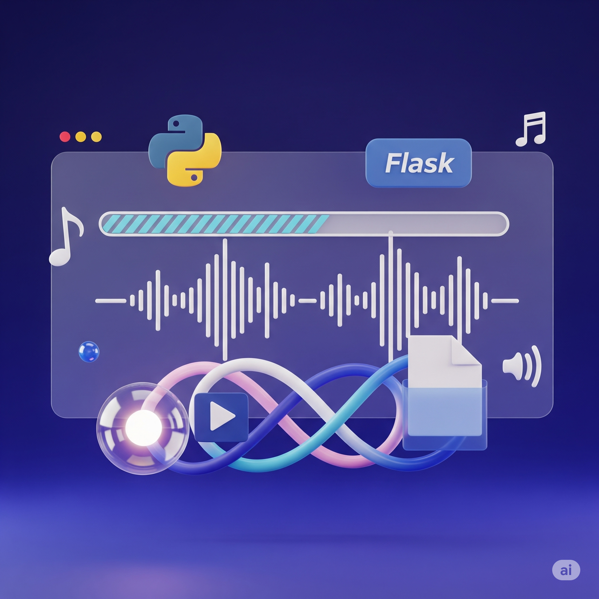

# YouTube Video Downloader (Educational Purposes Only)

This project is a modern, web-based **YouTube video downloader** built with **Python** and **Flask**, designed purely for **educational purposes**. It offers a straightforward interface for fetching and downloading video or audio streams from YouTube links.

The backend smartly leverages both `pytube` and `yt-dlp` libraries for robust stream extraction, with an **automatic fallback to `yt-dlp`** if `pytube` encounters issues. Users can simply input a YouTube URL, browse all available download options (including various resolutions and audio-only streams), and **track download progress in real time**.

This application serves as a practical example for integrating third-party video extraction tools within a Flask web framework. It also provides a hands-on demonstration of handling **asynchronous tasks, progress tracking, and efficient file management** in a Python web application. All downloads are saved locally in a structured directory.

**Disclaimer:**

> This project is strictly for educational use. Users are reminded to respect YouTube's Terms of Service and only download content they have rights to. Downloading YouTube videos may violate YouTube's Terms of Service.

-----

## Features

* **Fetch Streams:** Retrieve all available video and audio streams from any YouTube URL.
* **Flexible Downloads:** Download selected video resolutions or audio-only streams.
* **Real-time Progress:** Track the status of your downloads as they complete.
* **Robust Backend:** Utilizes `pytube` with an automatic fallback to `yt-dlp` for reliable stream extraction.
* **Local Storage:** All downloaded content is saved in a structured `downloads/` directory.

-----

## Setup Instructions

### Prerequisites

Before you begin, ensure you have:

* **Python 3.8+** installed.
* **`yt-dlp`** installed and accessible in your system's PATH.

### Installation

Follow these steps to get the project running locally:

1.  **Clone the repository:**
    ```bash
    git clone <your-repo-url>
    cd yt-download
    ```
2.  **Install Python dependencies:**
    ```bash
    pip install -r requirements.txt
    ```
3.  **Install `yt-dlp`:**
    If you haven't already, install `yt-dlp`. You can install it via pip or your system's package manager:
    ```bash
    pip install yt-dlp
    # Or for system-wide installation (examples):
    # brew install yt-dlp  # on macOS
    # sudo apt install yt-dlp  # on Ubuntu/Debian
    ```

-----

## Running the App

1.  **Start the Flask server:**
    ```bash
    python run.py
    ```
2.  **Access the application:**
    Open your web browser and navigate to: [http://127.0.0.1:5000](http://127.0.0.1:5000)

### Usage

* Simply paste a YouTube video URL into the input field.
* Select your desired stream (video resolution or audio-only) from the options provided.
* Click the download button and monitor the progress.

-----

## Important Notes

* All downloaded files are stored locally in the `downloads/` directory within the project's root.
* This application is strictly for **local and educational use**. It is not designed or intended for public deployment.

-----

## License

This project is provided for **educational purposes only** and is not intended for commercial use.